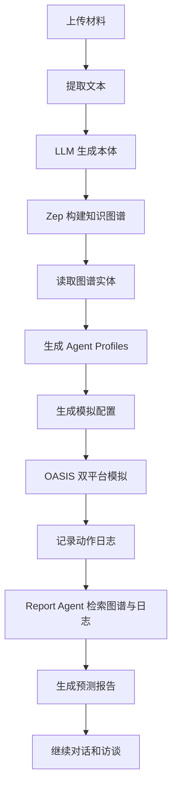
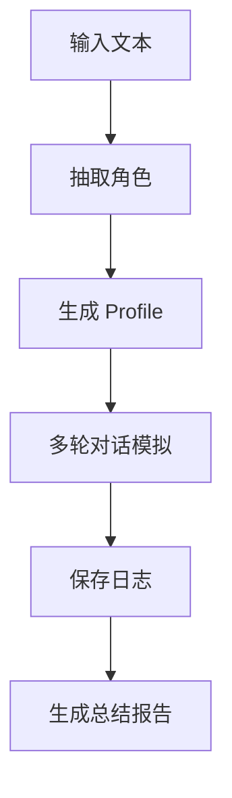

# MiroFish Agent 项目小白学习全书

> 从零开始读懂一个真实的多 Agent 预测沙盘项目。

本书为学习仓库 `MiroFish-learn` 的主教材。它不是 MiroFish 官方文档，而是面向初学者的源码导读、概念拆解和工程学习路线。

原项目本地路径：

```text
/Users/howarddong/develop/code/MiroFish
```

学习仓库本地路径：

```text
/Users/howarddong/develop/code/MiroFish-learn
```

## 写给完全小白的开场

如果你刚开始学 Agent，不要被项目里的词吓到：

- LLM：大语言模型，比如 GPT、Qwen、Claude 这一类模型。
- Agent：不只是聊天机器人，而是“能根据目标、上下文和工具做事的程序角色”。
- 多 Agent：不是一个 Agent，而是一群 Agent 共同互动。
- 知识图谱：把“人、组织、事件、关系、事实”变成节点和边。
- RAG：让模型先查资料，再回答。
- GraphRAG：让模型查图谱，而不仅是查文本片段。
- OASIS：一个多智能体社交模拟框架。
- Zep：一个记忆/图谱服务，用来保存实体、关系和时间性事实。
- 前端：浏览器里你看见和点击的界面。
- 后端：处理请求、调用模型、保存数据、运行模拟的服务。
- API：前端和后端说话的接口。

MiroFish 可以理解成一个“未来推演游戏引擎”。你给它一份材料，比如一篇新闻、一份报告、一段小说，它会先理解材料里有哪些角色、组织和关系，再把这些角色变成 Agent，让它们在模拟社交平台里发帖、点赞、评论、转发，最后再生成一份预测报告。

## 本书怎么读

你可以按三遍来读：

第一遍只看大图：

```text
第 1 章 -> 第 2 章 -> 第 3 章
```

目标是知道这个项目“是什么、怎么跑、有哪些模块”。

第二遍看核心链路：

```text
第 4 章 -> 第 5 章 -> 第 6 章 -> 第 7 章 -> 第 8 章
```

目标是理解“上传材料到模拟报告”这条链路。

第三遍开始动手：

```text
第 9 章 -> 第 10 章 -> 第 11 章 -> 第 12 章
```

目标是本地运行、排错、修改、做自己的小项目。

---

# 第 1 章：MiroFish 是什么

## 1.1 一句话理解

MiroFish 是一个多智能体预测模拟系统：

```text
输入：现实材料 + 预测问题
过程：抽取实体关系 -> 构建图谱记忆 -> 生成 Agent -> 运行社交平台模拟
输出：模拟过程 + 预测报告 + 可继续对话的模拟世界
```

它不是简单问答系统。简单问答系统通常是：

```text
你问一句 -> 模型答一句
```

MiroFish 是：

```text
你给一堆材料 -> 系统造一个小世界 -> 多个 Agent 在世界里行动 -> 报告 Agent 总结世界演化
```

## 1.2 为什么叫多 Agent

一个 Agent 可以理解成“带有目标、记忆、工具和行为规则的智能角色”。

在 MiroFish 里，Agent 可能代表：

- 一个学生
- 一个教授
- 一个媒体账号
- 一个公司
- 一个政府部门
- 一个普通网友
- 一个组织
- 一个社群

这些 Agent 会被放到类似 Twitter 和 Reddit 的环境里。它们不是只说一句话，而是可以执行动作，例如：

- 发帖
- 点赞
- 评论
- 转发
- 关注
- 搜索帖子
- 什么都不做

所以 MiroFish 学起来很有价值，因为它展示了 Agent 项目从“模型调用”到“复杂系统编排”的完整过程。

## 1.3 MiroFish 的五步产品流程

原项目 README 把流程分成五步：

```text
1. 图谱构建
2. 环境搭建
3. 开始模拟
4. 报告生成
5. 深度互动
```

翻译成小白语言：

```text
图谱构建：
  先读懂材料里有哪些人、组织、关系、事实。

环境搭建：
  把图谱中的实体变成一个个可行动的 Agent。

开始模拟：
  让这些 Agent 在模拟平台里互动若干轮。

报告生成：
  让 Report Agent 读取模拟结果，写一份分析报告。

深度互动：
  你可以继续问 Report Agent，也可以采访某个模拟 Agent。
```

## 1.4 项目总流程图



---

# 第 2 章：先看目录，不急着看代码

## 2.1 项目根目录

MiroFish 根目录大致是：

```text
MiroFish/
  README.md
  README-ZH.md
  package.json
  docker-compose.yml
  Dockerfile
  backend/
  frontend/
  locales/
  static/
```

每个目录的作用：

```text
README.md / README-ZH.md
  项目说明文档。

package.json
  根目录命令入口，用 npm 同时管理前端和后端。

docker-compose.yml / Dockerfile
  Docker 部署相关。

backend/
  后端代码，负责 API、模型调用、图谱、模拟、报告。

frontend/
  前端代码，负责网页界面。

locales/
  多语言文本。

static/
  图片和截图资源。
```

## 2.2 后端目录

后端目录：

```text
backend/
  run.py
  pyproject.toml
  requirements.txt
  app/
    __init__.py
    config.py
    api/
    services/
    models/
    utils/
  scripts/
```

解释：

```text
run.py
  后端启动入口。

app/config.py
  配置管理，比如 LLM Key、Zep Key、上传目录。

app/api/
  API 路由。前端请求先进这里。

app/services/
  核心业务逻辑。比如本体生成、图谱构建、模拟运行、报告生成。

app/models/
  数据模型和本地持久化。比如项目 Project、任务 Task。

app/utils/
  工具函数。比如日志、文件解析、模型客户端。

scripts/
  运行 OASIS 模拟的独立脚本。
```

## 2.3 前端目录

前端目录：

```text
frontend/
  package.json
  vite.config.js
  index.html
  src/
    main.js
    App.vue
    router/
    api/
    views/
    components/
    i18n/
    store/
```

解释：

```text
src/main.js
  前端入口。

src/router/index.js
  页面路由。

src/api/
  前端请求后端的封装。

src/views/
  页面级组件。

src/components/
  页面里的局部组件。

src/i18n/
  中英文切换。

src/store/
  简单的前端状态存储。
```

---

# 第 3 章：运行前你需要知道什么

## 3.1 需要的工具

运行 MiroFish 需要：

```text
Node.js >= 18
Python >= 3.11 且 <= 3.12
uv
npm
LLM API Key
Zep API Key
```

Node.js 用来跑前端。Python 用来跑后端。uv 用来安装 Python 依赖。LLM API Key 用来调用大模型。Zep API Key 用来构建和查询知识图谱。

## 3.2 环境变量

项目根目录有 `.env.example`，你需要复制成 `.env`：

```bash
cp .env.example .env
```

关键配置：

```env
LLM_API_KEY=your_api_key_here
LLM_BASE_URL=https://dashscope.aliyuncs.com/compatible-mode/v1
LLM_MODEL_NAME=qwen-plus
ZEP_API_KEY=your_zep_api_key_here
```

小白注意：`.env` 是放密钥的地方，不要提交到公开 GitHub 仓库。

## 3.3 一键安装和启动

在 MiroFish 根目录执行：

```bash
npm run setup:all
npm run dev
```

启动后：

```text
前端：http://localhost:3000
后端：http://localhost:5001
健康检查：http://localhost:5001/health
```

## 3.4 package.json 说明

根目录 `package.json` 的命令：

```text
npm run setup
  安装根目录和 frontend 的 Node 依赖。

npm run setup:backend
  进入 backend，用 uv 安装 Python 依赖。

npm run setup:all
  同时安装前端和后端依赖。

npm run backend
  启动 Flask 后端。

npm run frontend
  启动 Vite 前端。

npm run dev
  同时启动前端和后端。
```

---

# 第 4 章：后端入口与 API 总览

## 4.1 后端从哪里启动

后端入口：

```text
backend/run.py
```

它做三件事：

```text
1. 读取和验证配置
2. 创建 Flask 应用
3. 启动 Web 服务
```

伪代码：

```python
errors = Config.validate()
if errors:
    print("配置错误")
    sys.exit(1)

app = create_app()
app.run(host="0.0.0.0", port=5001)
```

这说明后端启动前会检查：

```text
LLM_API_KEY
ZEP_API_KEY
```

如果你没有配置，后端会直接退出。

## 4.2 Flask 应用工厂

Flask app 创建在：

```text
backend/app/__init__.py
```

关键代码逻辑：

```text
1. 创建 Flask 实例
2. 加载 Config
3. 启用 CORS
4. 注册模拟进程清理函数
5. 注册请求日志
6. 注册 API 蓝图
7. 提供 /health 健康检查
```

蓝图注册：

```python
app.register_blueprint(graph_bp, url_prefix='/api/graph')
app.register_blueprint(simulation_bp, url_prefix='/api/simulation')
app.register_blueprint(report_bp, url_prefix='/api/report')
```

## 4.3 三大 API 模块

### `/api/graph`

负责：

```text
项目创建和查询
文件上传
本体生成
图谱构建
任务状态查询
图谱数据查询
```

源码：

```text
backend/app/api/graph.py
```

### `/api/simulation`

负责：

```text
创建模拟
准备模拟环境
启动模拟
停止模拟
读取模拟状态
读取帖子、评论、动作、时间线
采访 Agent
关闭模拟环境
```

源码：

```text
backend/app/api/simulation.py
```

### `/api/report`

负责：

```text
生成报告
查询报告状态
读取报告
下载报告
和 Report Agent 聊天
读取 Agent 日志
提供报告工具 API
```

源码：

```text
backend/app/api/report.py
```

---

# 第 5 章：第一条主线，上传材料到本体生成

## 5.1 什么是本体

本体可以理解成“系统准备怎么认识这个世界的规则”。

比如你上传的是校园舆情材料，系统可能识别出实体类型：

```text
Student
Professor
University
MediaOutlet
GovernmentAgency
Person
Organization
```

关系类型：

```text
STUDIES_AT
WORKS_FOR
REPORTS_ON
COMMENTS_ON
SUPPORTS
OPPOSES
RESPONDS_TO
```

如果没有本体，图谱构建就会很混乱。模型可能把“情绪”“趋势”“支持方”都当成实体。但在 MiroFish 里，实体最终可能变成 Agent，所以实体必须是能发声、能互动的主体。

## 5.2 前端怎么发请求

前端文件：

```text
frontend/src/api/graph.js
```

方法：

```js
export function generateOntology(formData) {
  return requestWithRetry(() =>
    service({
      url: '/api/graph/ontology/generate',
      method: 'post',
      data: formData,
      headers: {
        'Content-Type': 'multipart/form-data'
      }
    })
  )
}
```

小白解释：

```text
multipart/form-data
  表示这个请求会上传文件。

requestWithRetry
  表示失败时会重试几次。

service
  是封装好的 axios 实例。
```

## 5.3 后端入口

后端接口：

```text
POST /api/graph/ontology/generate
```

源码函数：

```text
backend/app/api/graph.py
generate_ontology()
```

它读取：

```text
files
simulation_requirement
project_name
additional_context
```

其中 `simulation_requirement` 是必填的。因为同一份材料，不同预测问题会需要不同本体。

例如：

```text
预测舆情走向
  需要媒体、公众人物、学生、学校、监管部门等实体。

预测商业竞争
  需要公司、高管、投资人、消费者、供应链等实体。

推演小说结局
  需要角色、家族、组织、地点中的行动主体。
```

## 5.4 文本提取

文件处理工具：

```text
backend/app/utils/file_parser.py
backend/app/services/text_processor.py
```

支持格式来自配置：

```python
ALLOWED_EXTENSIONS = {'pdf', 'md', 'txt', 'markdown'}
```

流程：

```text
1. 检查文件后缀
2. 保存文件到项目目录
3. 从文件中提取文本
4. 清洗文本
5. 拼接多份文件内容
```

## 5.5 LLMClient

模型调用封装：

```text
backend/app/utils/llm_client.py
```

它统一使用 OpenAI SDK 兼容格式：

```python
self.client = OpenAI(
    api_key=self.api_key,
    base_url=self.base_url
)
```

两个核心方法：

```text
chat()
  返回普通文本。

chat_json()
  要求模型返回 JSON，并解析成 Python 字典。
```

这是 Agent 项目里非常重要的工程习惯：不要在每个业务文件里到处写模型调用，而是统一封装。

## 5.6 OntologyGenerator

核心源码：

```text
backend/app/services/ontology_generator.py
```

职责：

```text
输入：文档文本 + 模拟需求 + 额外上下文
输出：entity_types + edge_types + analysis_summary
```

它的系统提示词要求：

```text
必须输出 JSON
实体必须是真实存在、可在社媒发声和互动的主体
必须包含 Person 和 Organization 兜底类型
实体类型名称用英文 PascalCase
关系类型名称用英文 UPPER_SNAKE_CASE
属性名用英文 snake_case
```

这一步是整个系统的“世界观设计”。如果本体设计错了，后续图谱、Agent、模拟、报告都会受影响。

---

# 第 6 章：第二条主线，构建 Zep 知识图谱

## 6.1 为什么需要图谱

普通文本检索只知道：

```text
哪段文字和问题相似
```

图谱还知道：

```text
谁是谁
谁和谁有关
关系是什么
事实什么时候有效
哪些事实已经失效
```

对于多 Agent 模拟，这很重要。因为 Agent 不是孤立说话，它们的行为应该受关系影响。

## 6.2 前端请求

前端方法：

```text
frontend/src/api/graph.js
buildGraph(data)
```

请求：

```text
POST /api/graph/build
```

图谱构建可能比较慢，所以后端会创建任务，前端轮询任务状态：

```text
GET /api/graph/task/:taskId
```

## 6.3 GraphBuilderService

核心源码：

```text
backend/app/services/graph_builder.py
```

主要流程：

```text
build_graph_async()
  创建任务，启动后台线程。

_build_graph_worker()
  真正执行图谱构建。

create_graph()
  在 Zep 创建 graph。

set_ontology()
  把本体设置到 Zep。

add_text_batches()
  分批上传文本块。

_wait_for_episodes()
  等待 Zep 完成处理。

_get_graph_info()
  获取节点数、边数、实体类型等信息。
```

## 6.4 异步任务为什么重要

构建图谱可能耗时几十秒甚至更久。如果 Flask 接口一直卡着，用户体验会很差，也容易超时。

所以项目使用模式：

```text
前端发起任务
后端立刻返回 task_id
后台线程慢慢处理
前端定时查询进度
完成后前端进入下一步
```

这是所有长任务 Agent 产品都要学会的设计。

## 6.5 动态创建 Zep 本体类

`set_ontology()` 有一个高级但很实用的技巧：

```text
根据 LLM 生成的 JSON 动态创建 Pydantic 类。
```

也就是说，系统不是预先写死 `Student`、`Professor`、`Company`，而是根据用户材料动态生成类型，再交给 Zep。

这是 MiroFish “通用预测”能力的重要来源。

---

# 第 7 章：第三条主线，从图谱实体到 Agent Profile

## 7.1 为什么图谱实体还不是 Agent

图谱实体可能只是：

```text
张三
某大学
某媒体
某公司
```

但 Agent 需要更多信息：

```text
它是谁
它有什么立场
它关心什么
它会怎么说话
它的行动倾向是什么
它知道哪些事实
它在社交平台中活跃不活跃
```

所以要从实体生成 Agent Profile。

## 7.2 创建模拟

接口：

```text
POST /api/simulation/create
```

作用：

```text
创建一个 simulation_id
绑定 project_id 和 graph_id
记录启用哪些平台
保存 state.json
```

核心服务：

```text
backend/app/services/simulation_manager.py
```

## 7.3 准备模拟

接口：

```text
POST /api/simulation/prepare
```

`SimulationManager.prepare_simulation()` 做这些事：

```text
1. 从 Zep 读取实体
2. 过滤出本体定义过的实体类型
3. 为每个实体生成 Agent Profile
4. 生成 OASIS 模拟配置
5. 保存配置文件
6. 把模拟状态更新为 ready
```

## 7.4 关键服务

```text
ZepEntityReader
  从 Zep 图谱读取和过滤实体。

OasisProfileGenerator
  根据实体信息生成人设。

SimulationConfigGenerator
  根据模拟需求生成模拟参数。

SimulationManager
  统筹上面所有步骤。
```

## 7.5 模拟目录

准备完成后会生成：

```text
backend/uploads/simulations/sim_xxxxx/
  state.json
  simulation_config.json
  reddit_profiles.json
  twitter_profiles.csv
```

小白解释：

```text
state.json
  记录这个模拟的整体状态。

simulation_config.json
  OASIS 运行需要的参数。

reddit_profiles.json
  Reddit 平台 Agent 人设。

twitter_profiles.csv
  Twitter 平台 Agent 人设。
```

---

# 第 8 章：第四条主线，OASIS 双平台并行模拟

## 8.1 模拟启动

接口：

```text
POST /api/simulation/start
```

核心服务：

```text
backend/app/services/simulation_runner.py
```

实际脚本：

```text
backend/scripts/run_parallel_simulation.py
```

## 8.2 为什么要用子进程

模拟很慢，可能跑很多轮。如果直接在 Flask 请求里跑，浏览器会一直等待，服务也容易卡住。

所以系统采用：

```text
Flask API 负责发号施令
SimulationRunner 启动后台子进程
OASIS 脚本在子进程里跑模拟
前端定时查询 run_state
```

这是非常典型的工程分层。

## 8.3 双平台动作

Twitter 动作：

```text
CREATE_POST
LIKE_POST
REPOST
FOLLOW
DO_NOTHING
QUOTE_POST
```

Reddit 动作：

```text
LIKE_POST
DISLIKE_POST
CREATE_POST
CREATE_COMMENT
LIKE_COMMENT
DISLIKE_COMMENT
SEARCH_POSTS
SEARCH_USER
TREND
REFRESH
DO_NOTHING
FOLLOW
MUTE
```

这些动作定义了模拟世界的规则。Agent 不能无限制乱做事，只能在动作空间里选择。

## 8.4 日志是模拟世界的历史

模拟运行后会有：

```text
twitter/actions.jsonl
reddit/actions.jsonl
simulation.log
run_state.json
```

`actions.jsonl` 每行通常代表一个动作事件。JSONL 的好处是：

```text
可以边写边读
不需要一次加载整个大文件
适合长时间运行的日志
```

## 8.5 IPC：模拟结束后还能采访 Agent

`run_parallel_simulation.py` 支持等待命令。也就是说，模拟跑完后不一定马上退出，而是可以继续接受：

```text
interview
batch_interview
close_env
```

这就是为什么你后面可以“采访某个 Agent”。系统通过文件式 IPC 把命令发给模拟进程，再读取回复。

---

# 第 9 章：第五条主线，Report Agent 写报告

## 9.1 Report Agent 是什么

Report Agent 是站在模拟世界之外的观察者。它不参与发帖点赞，而是读取：

```text
原始模拟需求
Zep 图谱
模拟动作日志
帖子和评论
Agent 行为统计
```

然后生成报告。

## 9.2 报告接口

主要接口：

```text
POST /api/report/generate
GET /api/report/generate/status
GET /api/report/<report_id>
POST /api/report/chat
GET /api/report/<report_id>/agent-log
```

源码：

```text
backend/app/api/report.py
backend/app/services/report_agent.py
backend/app/services/zep_tools.py
```

## 9.3 Report Agent 的流程

大致流程：

```text
1. 获取模拟上下文
2. 规划报告大纲
3. 分章节生成
4. 每一章中可能调用工具检索
5. 生成最终报告
6. 保存报告和 Agent 日志
```

## 9.4 ReAct 思想

ReAct 是 Reasoning + Acting。简单说就是：

```text
想一想
调用工具
看工具结果
再想一想
继续调用工具或生成答案
```

在 MiroFish 里，Report Agent 会记录：

```text
react_thought
tool_call
tool_result
llm_response
section_content
```

这让你可以复盘 Report Agent 为什么这样写报告。

## 9.5 Zep 工具

工具封装：

```text
backend/app/services/zep_tools.py
```

主要工具概念：

```text
QuickSearch
  快速查相关事实。

PanoramaSearch
  查全景信息，包括历史和过期事实。

InsightForge
  深度洞察检索，会拆子问题并综合实体、关系、事实。

Interview
  和模拟 Agent 对话。
```

这是一个很好的工具设计案例：不是把所有能力塞进一个大工具，而是按不同检索需求拆成多个工具。

---

# 第 10 章：前端工作台怎么组织复杂流程

## 10.1 前端不是装饰

在 Agent 产品里，前端不只是“漂亮页面”。它要解决：

```text
长任务如何展示进度
失败如何提示
多阶段流程如何引导
日志如何实时显示
图谱如何可视化
用户如何回到历史项目
```

## 10.2 路由

源码：

```text
frontend/src/router/index.js
```

路由：

```text
/
/process/:projectId
/simulation/:simulationId
/simulation/:simulationId/start
/report/:reportId
/interaction/:reportId
```

这和产品五步流程对应。

## 10.3 API 封装

统一请求实例：

```text
frontend/src/api/index.js
```

它设置：

```text
baseURL: http://localhost:5001
timeout: 300000
Accept-Language
错误处理
重试函数
```

各业务 API：

```text
frontend/src/api/graph.js
frontend/src/api/simulation.js
frontend/src/api/report.js
```

## 10.4 MainView

核心页面：

```text
frontend/src/views/MainView.vue
```

它管理：

```text
viewMode
currentStep
currentPhase
projectData
graphData
systemLogs
pollTimer
graphPollTimer
```

这里你能学到前端状态机思想：一个复杂流程页面，不要只靠按钮跳转，要明确保存当前步骤、阶段、数据和轮询任务。

## 10.5 图谱面板

图谱显示组件：

```text
frontend/src/components/GraphPanel.vue
```

它使用 D3 来展示节点和边。图谱不是纯装饰，它帮助用户看到系统从材料中抽取了哪些实体关系。

---

# 第 11 章：数据如何保存

## 11.1 这个项目没有传统数据库

MiroFish 大量使用文件落盘：

```text
JSON
JSONL
CSV
TXT
上传原文件
```

这对学习很友好，因为你可以直接打开文件看状态。

## 11.2 Project

源码：

```text
backend/app/models/project.py
```

目录：

```text
backend/uploads/projects/proj_xxxxx/
  project.json
  extracted_text.txt
  files/
```

Project 状态：

```text
created
ontology_generated
graph_building
graph_completed
failed
```

## 11.3 Task

源码：

```text
backend/app/models/task.py
```

任务用于表示后台长任务，比如图谱构建。

任务通常包含：

```text
task_id
task_type
status
progress
message
result
error
```

## 11.4 Simulation

目录：

```text
backend/uploads/simulations/sim_xxxxx/
```

关键文件：

```text
state.json
run_state.json
simulation_config.json
reddit_profiles.json
twitter_profiles.csv
twitter/actions.jsonl
reddit/actions.jsonl
```

## 11.5 Report

报告目录：

```text
backend/uploads/reports/report_xxxxx/
```

重要文件：

```text
report.json
agent_log.jsonl
```

`agent_log.jsonl` 是学习 Agent 可观测性的宝藏。你可以看到 Agent 什么时候规划、什么时候调用工具、工具返回了什么、最后如何写成报告。

---

# 第 12 章：小白排错指南

## 12.1 后端启动失败：LLM_API_KEY 未配置

原因：

```text
.env 不存在
.env 不在项目根目录
LLM_API_KEY 为空
启动目录不对
```

检查：

```bash
cd /Users/howarddong/develop/code/MiroFish
ls -la .env
```

## 12.2 后端启动失败：ZEP_API_KEY 未配置

同理，检查 `.env`：

```env
ZEP_API_KEY=your_zep_api_key_here
```

## 12.3 前端打开了但接口报错

先检查后端：

```bash
curl http://localhost:5001/health
```

如果没有返回：

```json
{"status":"ok","service":"MiroFish Backend"}
```

说明后端没起来。

## 12.4 图谱构建很慢

正常。图谱构建会：

```text
切文本
上传到 Zep
等待 Zep 抽取实体和关系
拉取节点边信息
```

先用短文本测试，不要一上来上传几十万字。

## 12.5 模拟很贵或很慢

也正常。模拟会调用 LLM 多次，为多个 Agent 生成行为。建议：

```text
先减少轮数
先减少输入材料长度
先只启用一个平台
先用便宜模型测试
```

---

# 第 13 章：学习者应该重点读哪些文件

## 13.1 第一层：入口文件

```text
backend/run.py
backend/app/__init__.py
backend/app/config.py
frontend/src/router/index.js
frontend/src/api/index.js
```

目标：知道服务怎么启动，接口怎么注册，前端怎么访问后端。

## 13.2 第二层：图谱链路

```text
backend/app/api/graph.py
backend/app/services/ontology_generator.py
backend/app/services/graph_builder.py
backend/app/utils/llm_client.py
backend/app/utils/file_parser.py
```

目标：理解上传材料如何变成图谱。

## 13.3 第三层：模拟链路

```text
backend/app/api/simulation.py
backend/app/services/simulation_manager.py
backend/app/services/zep_entity_reader.py
backend/app/services/oasis_profile_generator.py
backend/app/services/simulation_config_generator.py
backend/app/services/simulation_runner.py
backend/scripts/run_parallel_simulation.py
```

目标：理解图谱实体如何变成 Agent，又如何运行模拟。

## 13.4 第四层：报告链路

```text
backend/app/api/report.py
backend/app/services/report_agent.py
backend/app/services/zep_tools.py
```

目标：理解 Report Agent 如何使用工具和图谱写报告。

## 13.5 第五层：前端工作台

```text
frontend/src/views/Home.vue
frontend/src/views/MainView.vue
frontend/src/views/SimulationView.vue
frontend/src/views/SimulationRunView.vue
frontend/src/views/ReportView.vue
frontend/src/views/InteractionView.vue
frontend/src/components/GraphPanel.vue
```

目标：理解复杂 Agent 流程如何被产品化。

---

# 第 14 章：建议的动手练习

## 14.1 练习一：画出 API 调用链

打开前端 API 文件，把每个按钮最终调用哪个后端接口画出来。

你会得到这样的链路：

```text
generateOntology -> /api/graph/ontology/generate
buildGraph -> /api/graph/build
createSimulation -> /api/simulation/create
prepareSimulation -> /api/simulation/prepare
startSimulation -> /api/simulation/start
generateReport -> /api/report/generate
```

## 14.2 练习二：给本体生成增加校验

目标：

```text
如果 LLM 生成的 entity_types 不是 10 个，就返回明确错误或重试。
```

涉及：

```text
backend/app/services/ontology_generator.py
```

你会学到：

```text
LLM 输出不能完全相信，必须校验。
```

## 14.3 练习三：新增 Agent Profile 字段

目标：

```text
给每个 Agent 增加 risk_preference 字段。
```

涉及：

```text
backend/app/services/oasis_profile_generator.py
```

你会学到：

```text
Agent 行为很大程度取决于 Profile。
```

## 14.4 练习四：新增动作统计 API

目标：

```text
统计每轮 CREATE_POST、LIKE_POST、CREATE_COMMENT 数量。
```

涉及：

```text
backend/app/api/simulation.py
backend/uploads/simulations/*/actions.jsonl
```

你会学到：

```text
如何从模拟日志反推出世界状态。
```

## 14.5 练习五：新增 Report Agent 工具

目标：

```text
输入 agent_id，返回该 Agent 的行为摘要。
```

涉及：

```text
backend/app/services/zep_tools.py
backend/app/services/report_agent.py
```

你会学到：

```text
Agent 工具如何设计，工具结果如何喂给模型。
```

---

# 第 15 章：从 MiroFish 提炼一个最小 Agent 项目

如果你觉得 MiroFish 太大，可以先自己做一个迷你版。

## 15.1 最小版目标

```text
输入一段材料
抽取 5 个角色
生成 5 个 Agent Profile
让它们围绕问题对话 5 轮
保存每轮发言
让 Report Agent 总结
```

## 15.2 最小版目录

```text
mini-agent-sim/
  app.py
  llm_client.py
  profile_generator.py
  simulator.py
  reporter.py
  data/
```

## 15.3 最小版流程



## 15.4 你会发现

当你做完最小版，再回头看 MiroFish，会发现它只是把每一步做得更工程化：

```text
角色抽取 -> 本体生成 + Zep 图谱
多轮对话 -> OASIS 双平台动作模拟
日志保存 -> JSONL + run_state
总结报告 -> Report Agent + Zep 工具
网页界面 -> Vue 工作台
```

---

# 结语

MiroFish 最值得学习的不是某个神奇 prompt，而是完整 Agent 系统的工程结构：

```text
输入如何变成结构化世界
世界如何变成 Agent
Agent 如何在规则内行动
行动如何被记录
记录如何被检索
检索如何支撑报告
长任务如何被前端展示
失败状态如何被保存和恢复
```

如果你能顺着这条线读懂 MiroFish，你就不只是会调用大模型，而是开始理解“Agent 产品”是怎么被做出来的。

